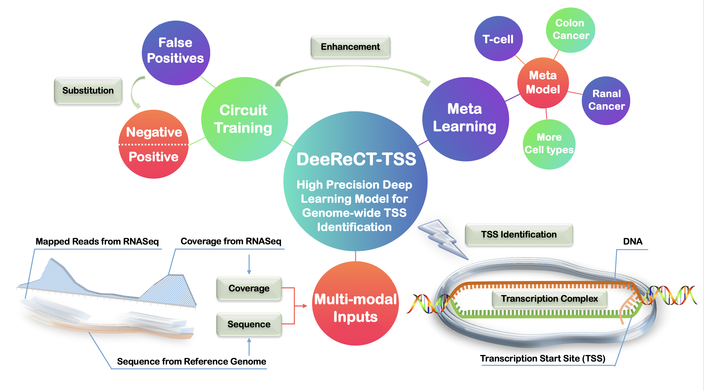
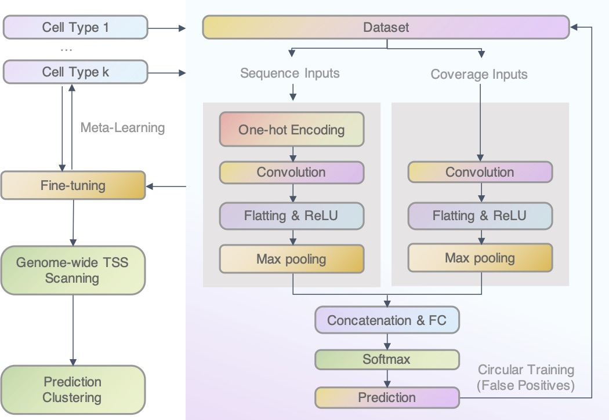

# DeeReCT-TSS: A novel meta-learning-based method annotates TSS in multiple cell types based on DNA sequences and RNA-seq data


## Overview



This repository contains the implementation of DeeReCT-TSS from 

Juexiao Zhou, Bin Zhang, et al. "DeeReCT-TSS: A novel meta-learning-based method annotates TSS in multiple cell types based on DNA sequences and RNA-seq data"

If you use our work in your research, please cite our paper:

Juexiao Zhou, Bin Zhang et al. DeeReCT-TSS: A novel meta-learning-based method annotates TSS in multiple cell types based on DNA sequences and RNA-seq data, 21 June 2021, PREPRINT (Version 1) available at Research Square [https://doi.org/10.21203/rs.3.rs-640669/v1]


## Model Design



## Prerequisites

The code is tested with the following dependencies:

- Python 3.6
- Biopython 1.78
- Numpy 1.19.2
- Scipy 1.5.2
- Scikit-learn 0.22.1
- Tensorflow-gpu 1.14.0
- Seaborn 0.11.1
- Matplotlib
- Samtools
- Bedtools

The code is not guaranteed to work if different versions are used.

## Genome-wide TSS Scanning

```
bash ./run.sh \
      path/to/Aligned.sortedByCoord.out.bam \  #(the aligned RNA-Seq bam file)
      path/to/gencode.v38.pcg.extups5k.bed \  #(the file provided under the folder /ref)
      path/to/model.npz \  #(the pre-trained models are provided under the folder /model)
      path/to/reference_genome.fa \ #(the file provided under the folder /ref)
      path/to/output \
      0 \  #(0: CPU, 1: GPU)
      25

eg:

bash ./run.sh \
      ../DeeReCT-TSS_release/data/TCGA-AA-3517-11A-01R-A32Z-07/rnaseq/Aligned.sortedByCoord.out.bam \
      ../DeeReCT-TSS_release/ref/gencode.v38.pcg.extups5k.bed \
      ../DeeReCT-TSS_release/model/colon_model/model_best.npz \
      ../DeeReCT-TSS_release/ref/hg38/hg38.fa \
      ./test_out/ \
      0 \
      25
```

## Acknowledgement

This project is supported by KAUST and SUSTech. 

